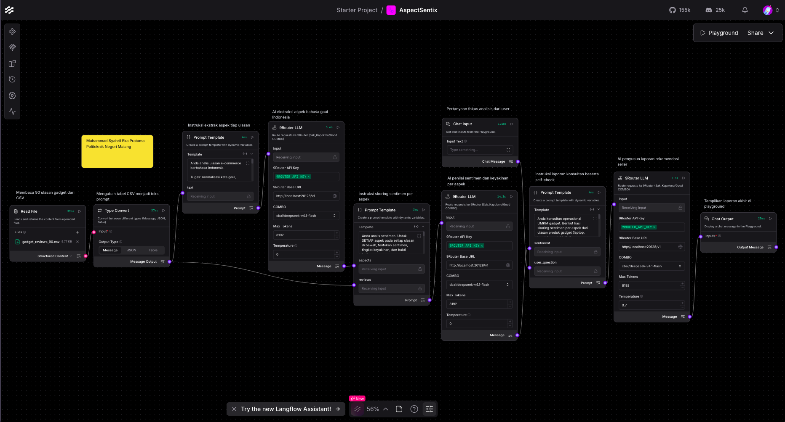
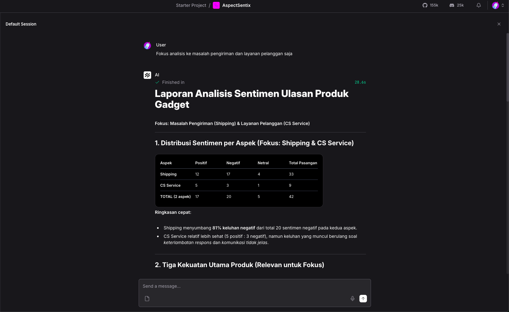

# AspectSentix

**Aspect-Based Sentiment Analysis for Indonesian gadget sellers** — built in
Langflow during the IBM SkillsBuild × Hacktiv8 capstone program.

Instead of a single sentiment score, AspectSentix extracts **which aspect**
(product quality, shipping, authenticity, price, …) a review talks about and
scores sentiment **per aspect**. Sellers get an actionable, ranked report —
not a flat positive/negative tally.

| | |
|---|---|
|  |  |

---

## Why it matters

Marketplace sellers (Tokopedia / Shopee / Lazada) receive **dozens of reviews**
every day.  A review like:

> _"Barang ok tapi kemasannya rusak dan lama banget sampainya."_

…is **mixed** on a global scale, but it actually raises **two negative
issues** (packaging, shipping) while one strength (product quality) is fine.
AspectSentix surfaces that difference so sellers can act precisely.

---

## How it works

```text
CSV (90 reviews)  ──┐
                     ├──► LLM stage 1  ──► aspect extractor + sentiment scorer
User question (opt) ──┘
                                    └──► LLM stage 2  ──► aggregator + narrative report
```

| Stage | Component (custom / built-in) | What it does |
|---|---|---|
| 1 Input | File + Chat Input | Reads CSV, accepts optional focus question |
| 2 Split | 5 Brancher nodes | Routes reviews per `rating` (1-5 stars) to isolate token budget |
| 3 Extract | `NineRouterLLM` (custom) | Per-rating: **ABSA** — extracts aspect + polarity + confidence + quotes |
| 4 Aggregate | `NineRouterLLM` + Code | Merges 5 branches, builds distribution table + narrative |
| 5 Report | structured output | `laporan_final.md` — table, strengths, weaknesses, action priorities |

![Prompt template]](./screenshots/3-prompt-template-1.png)
*Stage-1 prompt template — aspect extraction + confidence scoring.*

![Prompt template]](./screenshots/4-prompt-template-2.png)
*Stage-2 prompt template — aggregation + recommendation synthesis.*

---

## Sample output

From a real 90-review dataset of laptop / handphone / tablet sellers:

### Sentiment distribution per aspect

| Aspect | Positive | Negative | Total |
|---|---|---|---|
| **Product Quality** | 22 | 26 | 48 |
| **Shipping** | 17 | 17 | 34 |
| **Authenticity** | 9 | **15** | 24 |
| Packaging | 8 | 3 | 11 |
| Price | 4 | 2 | 7 |

### Top 3 improvement priorities (automated)

1. **Audit product photos** — 15 negative `authenticity` complaints (color
   mismatch, wrong variant) → match photo to shipped unit
2. **Pre-shipping QC checklist** — 26 negative `product_quality` complaints
   (scratches, missing accessories) → inspect before packing
3. **Update shipping ETA** — 17 negative `shipping` complaints → realistic ETAs
   + auto-delay notifications

Full report → [`output/laporan_final.md`](./output/laporan_final.md)

---

## Key improvisations (over standard Langflow templates)

1. **9Router** — custom LLM component wired to a private endpoint, supporting
   dynamic model selection + structured JSON schema enforcement
2. **Rating isolation** — reviews split into 5 branches by star-rating, keeping
   each LLM call ~2.7 K tokens (not 13 K) and avoiding aggregation drift
3. **Confidence-gated** — reviews with `confidence ≤ 0.6` routed to manual QA
   list, preventing bad signals
4. **Aspect-level scoring** — pure aspect-based, not document-level sentiment
5. **Priorities with effort estimate** — each recommendation tagged *Low / Med /
   High* impact + time cost (1-3 days), so sellers can pick weekly sprints

---

## Tech stack

| Layer | Tool |
|---|---|
| Flow runtime | **Langflow 1.10.0** |
| LLM backbone | DeepSeek-V3-0324 (via `NineRouterLLM` custom component) |
| Prompt engineering | 2-stage ABSA: extract → aggregate |
| Data prep | `build_dataset.py` (rating-stratified, 90 reviews) |
| Visualization | 5 screenshots auto-exported from Langflow UI |
| Format | CSV input → JSON schema → markdown report |

---

## Repository structure

```
aspectsentix/
├── PRD.md                      # Design doc (IBM submission form)
├── build_dataset.py            # Stratified split by rating → 5 branches
├── dataset/
│   ├── gadget_reviews.csv      # Full 394-review raw dataset
│   ├── gadget_reviews_90.csv   # 90-review stratified sample used in report
│   └── by_rating/              # Per-rating CSV splits
├── output/
│   ├── AspectSentix.json       # Langflow flow export (all credentials stripped)
│   ├── laporan_final.md        # Final narrative report
│   └── laporan_fokus_pengiriman_cs.md
├── archive/                    # Helper scripts (restore node code, etc.)
├── screenshots/                # Flow canvas + playground + prompt templates
├── .env.example
└── .gitignore
```

---

## How to run

```bash
# 0. Prerequisites
#    - Langflow 1.10.0 running at http://localhost:7860
#    - A DeepSeek API key (or any OpenRouter-compatible endpoint)

# 1. Environment
cp .env.example .env
# Edit .env:
#   CUSTOM_ENDPOINT_API_KEY=your_key_here
#   CUSTOM_ENDPOINT_URL=http://localhost:7860/api/v1

# 2. Import
#    In Langflow UI: Settings → Import Flow → output/AspectSentix.json

# 3. Connect inputs
#    - File Input  → point to dataset/gadget_reviews_90.csv
#    - Custom API Key → your key (field auto-reads from env)

# 4. Run
#    Click "Play" on ChatInput → outputs report to ChatOutput
```

> **Note:** The `NineRouterLLM` custom component is **not** in the public Langflow
> registry.  The flow ships with the component shell; you must supply the
> runtime implementation or substitute the built-in `OpenAIModel` node.

---

## Dataset

- **Source:** 394 gadget reviews, manually curated from marketplace comments
- **Sample:** 90 reviews, stratified by 1-5 star ratings
- **Fields:** `review` (text), `rating` (1-5), `category` (handphone / laptop)
- **Language:** Bahasa Indonesia
- **No PII:** only review text + rating + category; no names / emails / phone numbers

---

## Credits

- **Program:** IBM SkillsBuild × Hacktiv8 — Capstone Project
- **Submission date:** 2026-09-14

---

## License

Educational use. Dataset reviews are anonymized marketplace snippets.
