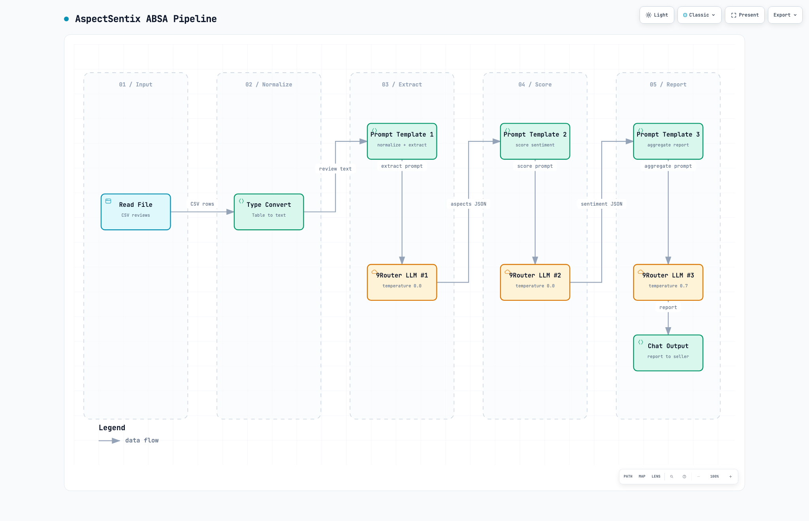

# AspectSentix

**Aspect-Based Sentiment Analysis for Indonesian gadget sellers** — built in
Langflow during the IBM SkillsBuild × Hacktiv8 capstone program.

Instead of a single sentiment score, AspectSentix extracts **which aspect**
(product quality, shipping, authenticity, price, …) a review talks about and
scores sentiment **per aspect**. Sellers get an actionable, ranked report —
not a flat positive/negative tally.

| | |
|---|---|
|  |  |

---

## Why it matters

Marketplace sellers (Tokopedia / Shopee / Lazada) receive **dozens of reviews**
every day.  A review like:

> _"Barang ok tapi kemasannya rusak dan lama banget sampainya."_

…is **mixed** on a global scale, but it actually raises **two negative
issues** (packaging, shipping) while one strength (product quality) is fine.
AspectSentix surfaces that difference so sellers can act precisely.

---

## How it works

The flow is a **3-stage LLM pipeline** — extraction, scoring, and
aggregation — each a separate call with a JSON contract between stages.

| Stage | Component | What it does |
|---|---|---|
| 1 Input | Read File + Type Convert | Loads CSV, converts tabular data to text for the prompt |
| 2 Extract | Prompt Template 1 + NineRouterLLM | Normalizes Indonesian slang, then extracts aspects into 9 fixed categories |
| 3 Score | Prompt Template 2 + NineRouterLLM | Assigns sentiment + confidence + evidence quote per (review, aspect) pair |
| 4 Aggregate | Prompt Template 3 + NineRouterLLM | Merges results into distribution table + narrative recommendations |
| 5 Output | Chat Output | `laporan_final.md` — table, strengths, weaknesses, action priorities |

An optional **Chat Input** node lets users ask a focus question (e.g., "analyze shipping only") — the report adapts to that lens.


*Three-stage ABSA pipeline. Generated with [Archify](https://github.com/tt-a1i/archify) from
`docs/architecture.dataflow.json` — validated via `--quality showcase`, 9/9 checks passed.*

> The diagram shows the 5 nodes (`Read File`, `Type Convert`, `Prompt Template 1`,
> `9Router LLM #1`, `Prompt Template 2`, `9Router LLM #2`, `Prompt Template 3`,
> `9Router LLM #3`, `Chat Output`) and 9 directed edges between them. Labels
> include `extract prompt`, `aspects JSON`, `score prompt`, `sentiment JSON`,
> `aggregate prompt`, `report`. Flow runs left-to-right with automatic routing.

---

## Sample output

From a real 90-review dataset of laptop / handphone / tablet sellers:

### Sentiment distribution per aspect

| Aspect | Positive | Negative | Neutral | Total |
|---|---|---|---|---|
| **Product Quality** | 22 | 26 | 0 | 48 |
| **Shipping** | 17 | 17 | 0 | 34 |
| **Authenticity** | 9 | **15** | 0 | 24 |
| Packaging | 8 | 3 | 0 | 11 |
| Price | 4 | 2 | 1 | 7 |

### Top 3 improvement priorities (automated)

1. **Audit product photos** — 15 negative `authenticity` complaints (color
   mismatch, wrong variant) → match photo to shipped unit
2. **Pre-shipping QC checklist** — 26 negative `product_quality` complaints
   (scratches, missing accessories) → inspect before packing
3. **Update shipping ETA** — 17 negative `shipping` complaints → realistic ETAs
   + auto-delay notifications

Full report → [`output/laporan_final.md`](./output/laporan_final.md)

---

## Key improvisations (over standard Langflow templates)

1. **9Router** — custom LLM component wired to a private endpoint, with a
   free-model combo so no paid provider is required
2. **3-stage ABSA pipeline** — the stock template does one global sentiment
   pass; this splits extraction, scoring, and aggregation into separate LLM
   calls with a JSON contract between stages
3. **Type Convert bridge** — the CSV loads as a `Table`; a converter node turns
   it into text the prompt can consume
4. **Slang normalization layer** — Indonesian colloquial forms (`mantappp`,
   `WKWK`, `lmyan`) are normalized inside Prompt Template 1 before extraction
5. **Confidence-gated** — reviews with `confidence ≤ 0.6` are flagged for human
   verification instead of being force-labeled
6. **Focus lens** — an optional Chat Input lets the seller ask a targeted
   question ("shipping only") and the report adapts
7. **Prioritized remediation** — recommendations come with an impact ranking
   and a 1–3 day effort estimate, so a seller can pick a weekly sprint

---

## Results & Limitations

### Coverage (from `output/laporan_final.md`, 90-review sample)

| Metric | Value |
|---|---|
| Reviews with ≥1 aspect detected | 82 / 90 |
| **Coverage** | **91.1%** |
| Reviews without any aspect | 8 (short / ambiguous reviews) |
| Aspect pairs (all aspects across all reviews) | 138 |
| Negative aspect share | 52.9% (73 / 138) |

### Confidence (from same report)

| Threshold | Count | % of all aspect pairs |
|---|---|---|
| confidence ≤ 0.6 | 12 rows | flagged for human review |
| confidence 0.7+ | remaining | auto-labeled |

`product_quality` accounts for 7 of 12 low-confidence rows — many short reviews ("barang ok", "barang udah nyampe, bagus") are genuinely ambiguous about which aspect they refer to.

### Known limitations

1. **No labeled ground truth.** Confidence is a self-reported proxy, not a calibrated probability. Without a gold-standard dataset, precision/recall/F1 cannot be computed.
2. **Non-deterministic aggregation.** Running the same flow twice can yield slightly different counts. `temperature=0` on extraction/scoring reduces variance; the final aggregation uses `temperature=0.7` for natural language, which introduces minor drift.
3. **Closed 9-aspect taxonomy.** Domain-specific aspects (e.g., "fragrance" for skincare) are silently dropped.
4. **Reproducibility gap.** `build_dataset.py` depends on an external upstream repo (`_dataset_repo/`) that is not bundled. The generated CSVs are committed; the builder cannot be re-run from this repo alone without cloning the source.
5. **Report language is Bahasa Indonesia.** The output is designed for Indonesian sellers, not international readers.

| Layer | Tool |
|---|---|
| Flow runtime | **Langflow 1.10.0** |
| LLM backend | Multi-model via `NineRouterLLM` (free models through 9Router) |
| Prompt engineering | 3-stage ABSA: extract → score → aggregate |
| Data prep | `build_dataset.py` (rating-stratified, seed=42) |
| Visualization | 5 screenshots exported manually from the Langflow UI |
| Format | CSV input → JSON schema → markdown report |

---

## Repository structure

```
aspectsentix/
├── PRD.md                      # Design doc (IBM submission form)
├── build_dataset.py            # Reproducible stratified sampler (seed=42)
├── dataset/
│   ├── gadget_reviews.csv      # Full 300-review stratified sample
│   ├── gadget_reviews_90.csv   # 90-review subset used in the sample report
│   └── by_rating/              # External rating-stratified splits (60/rating)
├── output/
│   ├── AspectSentix.json       # Langflow flow export (all credentials stripped)
│   ├── laporan_final.md        # Final narrative report
│   └── laporan_fokus_pengiriman_cs.md
├── archive/                    # Helper scripts (restore node code, etc.)
├── screenshots/                # Flow canvas + playground + prompt templates
├── .env.example
└── .gitignore
```

---

## How to run

```bash
# 0. Prerequisites
#    - Langflow 1.10.0 running at http://localhost:7860
#    - An API key for the 9Router custom endpoint (or equivalent)

# 1. Environment
cp .env.example .env
# Edit .env:
#   CUSTOM_ENDPOINT_API_KEY=your_key_here
#   CUSTOM_ENDPOINT_URL=http://localhost:7860/api/v1

# 2. Import
#    In Langflow UI: Settings → Import Flow → output/AspectSentix.json

# 3. Connect inputs
#    - File Input  → point to dataset/gadget_reviews_90.csv
#    - Custom API Key → your key (field auto-reads from env)

# 4. Run
#    Click "Play" on ChatInput → outputs report to ChatOutput
```

The `NineRouterLLM` custom component is **not** in the public Langflow
registry.  The flow ships with the component shell; you must supply the
runtime implementation or substitute the built-in `OpenAIModel` node.

> **Note:** Models used are free-tier through the 9Router combo — no single
> provider is required.

---

## Dataset

- **Source:** `revanmd/indonesian-dataset-SA-ML` — Lazada & Shopee reviews, >3M reviews across 200+ categories
- **Built via:** `build_dataset.py` — stratified sampling, `seed=42`, 95 rich + 5 short edge-case reviews per category
- **Sample used in flow:** `dataset/gadget_reviews_90.csv` — **90 reviews**, stratified across 5 ratings × 3 categories
- **Full sample:** `dataset/gadget_reviews.csv` — **300 reviews** (the full stratified sample, 100 per category)
- **Per-rating splits:** `dataset/by_rating/` — 60 rows per rating (1–5), produced externally
- **Fields:** `review` (text), `rating` (1–5), `category` (laptop / handphone / tablet)
- **Language:** Bahasa Indonesia, with colloquialisms, typos, and deliberate edge cases
- **No PII:** only review text + rating + category; no names / emails / phone numbers

> **Note:** `build_dataset.py` requires a sparse-clone of the upstream dataset repo
> (`_dataset_repo/`). The generated CSVs are committed, so you can run the flow
> without re-running the builder. To regenerate: clone `revanmd/indonesian-dataset-SA-ML`
> into `_dataset_repo/` and run `python build_dataset.py`.

---

## Credits

- **Program:** IBM SkillsBuild × Hacktiv8 — Capstone Project
- **Submission date:** 2026-09-14

---

## License

Educational use. Dataset reviews are anonymized marketplace snippets.
